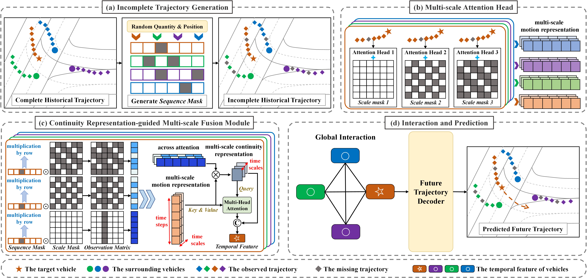
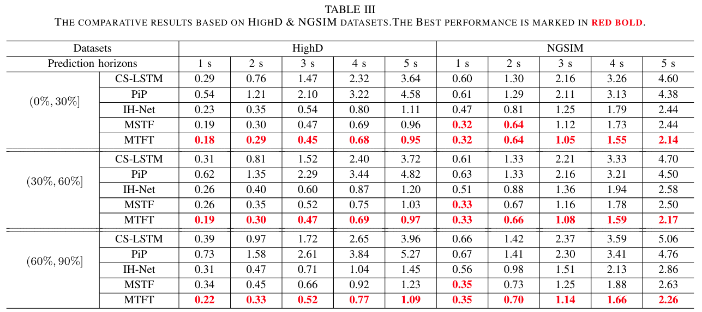
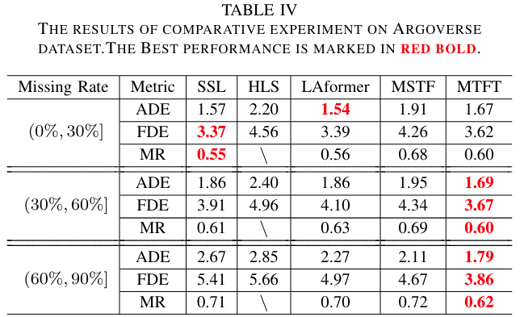

# Multi-scale-Temporal-Fusion-Transformer-for-Incomplete-Vehicle-Trajectory-Prediction
The official code for Paper “Multi-scale Temporal Fusion Transformer for Incomplete Vehicle Trajectory Prediction” 

[Paper]() 

Zhanwen Liu, Chao Li



Table of Contents
=================
  * Prepare Data
  * Training
  * Testing
  * Licence
  * Citation

## Prepare Data
The data preprocessing process is complex and time-consuming. We provide preprocessed data that can be downloaded [here](https://www.alipan.com/s/xX2fy1Pnvz8) 

## Training
Due to inconsistent hyperparameter settings (such as learning rate) on different datasets, we have divided the experiments on four different datasets into four different folders, and corresponding model training can be carried out through train.by in the folders. For example, training a model on the HighD dataset can execute the following command。
```sh
python Expe_HighD/Train-FMSTF.py
```

## Testing
Like the training process, we have divided the testing process on different datasets into four different folders. For example, testing on the HighD dataset can be performed using the following command
```sh
python Expe_HighD/Test-FMSTF.py
```
**Quantitative results**
The comparative experimental results based on HighD, NGSIM, and Argorse datasets are as follows





**Qualitative results**


## Licence
check [LICENSE](LICENSE)

## Citation
If you use our source code, please consider citing the following:
```bibtex
```


